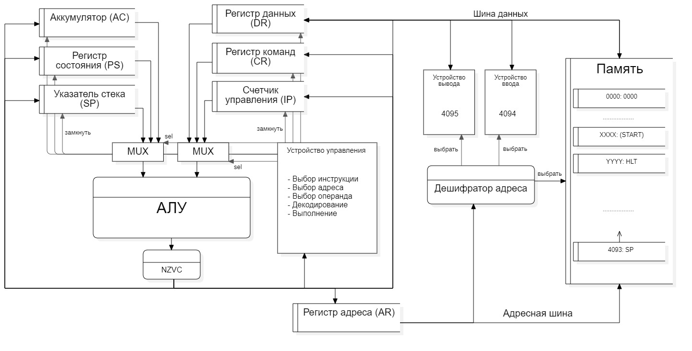

# Транслятор asm языка

- P33081, Киушкин Артем Эдуардович
- `asm | acc | neum | hw | tick | struct | stream | mem | pstr | prob5 | 8bit`
- Упрощенный вариант

## Язык программирования

### Синтаксис

**Форма Бэкуса-Наура:**

```ebnf
<программа> ::= <строка_программы> | <строка_программы> <программа>
<строка_программы> ::= <адрес> | [<метка>] <адресная команда> <операнд> | 
[<метка>] <безадресная команда> | [<метка>] <метка константы> <константа> | <пустая строка> 

<метка> ::= <слово>
<адресная команда> = add | load | store | ... | sub | jmp | (см. систему команд)
<безадресная команда> ::= cla | di | ei | ... | hlt
<операнд> ::= <число> | <метка>
<константа> ::= <число> | <число> '<слово>'
<слово> ::= <символ> | <слово> <символ>
<число> ::= <цифра> | <число> <цифра>
<цифра> ::= 0| 1 | 2 | .. | 8 | 9
<символ> ::= a | b | c | ... | z | A | B | C | ... | Z | <цифра>
```

**Пояснение:**

Каждая строка программы, содержащая код, соответствует одному из следующих элементов:

* Команда с адресацией
    * В начале может располагаться метка.
    * За ней следует имя команды и адрес операнда, разделенные пробелом.
* Команда без адресации
    * Также может начинаться с метки.
    * Содержит только имя команды.
* Объявление константы
    * Обозначается использованием метки константы word: и самой константы.
    * Константа может быть 16-битным числом со знаком.
    * Если константа является строкой, указывается её длина и сама строка, разделенные пробелом.
* Объявление адреса
    * Применяется ключевое слово org, за которым следует адрес в десятичной форме.

- Область видимости переменных является глобальной.
- Поддержка целочисленных констант в пределах от -2^{31} до 2^{31}-1.
- Для использования строковых констант символы строки нужно заключать в кавычки и указывать их длину перед строкой, отделяя запятой.
- Инструкции в программе выполняются по порядку.

- В начале программы должна быть обозначена точка входа с помощью метки start:, которая демонстрирует на первую инструкцию для выполнения. Эта метка не может ссылаться на константу.
- Имена меток должны быть уникальными, отличаться от имен команд и не начинаться с цифры.
- Метки размещаются в той же строке, что и инструкции; операнды также находятся в строке с инструкциями.
- Программа не учитывает пустые строки, а также пробелы в начале и в конце строк.
- Текст после символа ';' в строке считается комментарием и игнорируется.

Память для выполнения программа выделяется заранее (статически), при инициализации модели.

## Организация памяти

* Память команд и данныx --- общая
* Размер машинного слова --- `32` бит
* Память содержит `2^12` ячеек (`4096`)
* Адрес `4093` является указателем стека при старте процессора. Стек растет вверх.
* Ячейка с адресом `4094` маппится на устройство ввода
* Ячейка с адресом `4095` маппится на устройство вывода


* Поддерживаются следующие **виды адресаций**:
    * **Прямая**: в качестве аргумента команды передается адрес ячейки, значение в которой будет использовано как
      операнд.
      Например, если `mem[30] = 25`, то команда `add 30` обозначает, что к значению в аккумуляторе добавится число 25.

    * **Косвенная**: в качестве аргумента команды передается адрес, по которому лежит адрес операнда.
      Например, если `mem[30] = 25`, `mem[33] = 30`, то команда `add (33)` также обозначает, что к аккумулятору
      добавится значение 25.


* Существует несколько **регистров**:
    * Аккумулятор (AC): в него записываются результаты всех операций
    * Счетчик команд (IP): хранит адрес следующей выполняемой команды
    * Указатель стека (SP): при вызове прерывания текущее состояние счетчика команд сохраняется на стеке
    * Регистр состояния (PS): хранит маркер того, что наступило прерывание
        * 0-й бит хранит значение флага C
        * 1-й бит хранит значение флага Z
        * 2-й бит хранит значение флага N и 0, если запрещены (interrupts disabled)


* Регистр данных (DR): хранит данные для записи в память и считывания из памяти
* Регистр адреса (AR): хранит адрес последней ячейки в памяти, к которой было обращение

## Система команд

Каждая команда выполняется в несколько циклов:

1. `Instruction fetch`: по адресу из регистра счетчика команд из памяти достается код команды

- `IP -> AR, IP + 1 -> IP, MEM[AR] -> DR, DR -> CR`

2. `Operand fetch` . (ТОЛЬКО для команд, требующих адрес): Адрес операнда загружается в регистр данных, затем передаётся из регистра данных в регистр адресов, после чего значение операнда извлекается из памяти в регистр данных.

- `CR[ADDR] -> DR, DR -> AR, mem[AR] -> DR`

3. Цикл исполнения: совершаются действия, необходимые для выполнения команды. Результаты вычисления записываются в
   аккумулятор

### Набор инструкций

| Язык  | Адресная | Количество тактов<br/>(Execution)     | Описание                                                                                                                                           |
|:------|:---------|:--------------------------------------|:---------------------------------------------------------------------------------------------------------------------------------------------------|
| load  | +        | 3                                     | - Загрузить число из указанной ячейки в аккумулятор                                                                                                |
| store | +        | 3                                     | - Сохранить число в указанную ячейку из аккумулятора                                                                                               |
| add   | +        | 3                                     | - Прибавить число из указанной ячейки к содержимому аккумулятора.                                                                                  |
| sub   | +        | 3                                     | - Вычесть число из указанной ячейки из содержимого аккумулятора.                                                                                   |
| cmp   | +        | 3                                     | - Установить флаги на основе результата операции вычитания числа из указанной ячейки из аккумулятора, при этом оставить аккумулятор без изменений. |
| asl   | -        | 2                                     | - Сдвиг содержимого аккумулятора на один бит влево, крайний левый бит переносится в флаг C.                                                        |
| asr   | -        | 2                                     | - Сдвиг содержимого аккумулятора на один бит вправо, крайний правый бит переносится в флаг C.                                                      |
| dec   | -        | 2                                     | - Уменьшить содержимое аккумулятора на единицу.                                                                                                    |
| inc   | -        | 2                                     | - Увеличить содержимое аккумулятора на единицу.                                                                                                    |
| cla   | -        | 2                                     | - Обнулить содержимое аккумулятора.                                                                                                                |
| hlt   | -        | 2                                     | - Прекратить выполнение программы.                                                                                                                 |
| push  | -        | 2                                     | - Поместить число из аккумулятора в стек памяти.                                                                                                   |
| pop   | -        | 2                                     | - Извлечь число из стека памяти и загрузить его в аккумулятор.                                                                                     |
| nop   | -        | 1                                     | - Ни одной операции не выполняется.                                                                                                                |

#### Ветвления
| Язык  | Адресная | Количество тактов<br/>(Execution)     | Описание                                                                                                                                           |
|:------|:---------|:--------------------------------------|:---------------------------------------------------------------------------------------------------------------------------------------------------|
| jmp   | +        | 3                                     | - Безусловных переход к исполнению команды в указанной ячейке.                                                                                     |
| jmn   | +        | 3                                     | - Осуществить переход к указанной ячейке при условии, что флаг N равен 1.                                                                          |
| jmnn  | +        | 3                                     | - Осуществить переход к указанной ячейке при условии, что флаг N равен 0.                                                                          |
| jmc   | +        | 3                                     | - Осуществить переход к указанной ячейке при условии, что флаг C равен 1.                                                                          |
| jmnc  | +        | 3                                     | - Осуществить переход к указанной ячейке при условии, что флаг C равен 0.                                                                          |
| jmz   | +        | 3                                     | - Осуществить переход к указанной ячейке при условии, что флаг Z равен 1.                                                                          |
| jmnz  | +        | 3                                     | - Осуществить переход к указанной ячейке при условии, что флаг Z равен 0.                                                                          |

### Кодирование инструкций

- JSON (список)
- Каждый элемент списка -- команда или константа

Пример сереализованных константы `out: word: 4095` и команды `store (out)`

```json
[
    {'index': 1, 'value': 4095, 'opcode': 'nop'},
    ...
    {'index': 1027, 'opcode': 'store', 'operand': 1, 'value': 0, 'address': True},
]
```

где:

- `index` -- адрес объекта в памяти;
- `opcode` -- код операции, идентификатор команды; У констант для упрощения всегда "nop"
- `operand` -- аргумент команды, адрес ячейки над которой совершается операция. Отсуствует у безадресных команд и
  констант;
- `address` -- логическое поле, имеющее значение True, если адресация косвенная, и False, если прямая.
- `value` -- значение ячейке с адресом index, если она будет интерпретирована как данные. Так как команды сериализуются
  в высокоуровневую структуру, было принято решение установить у команд это значение в 0.

## Транслятор

Запуск в CLI: `translator.py <input_file> <target_file>`

Реализовано в модуле: [translator](./translator.py)

Этапы трансляции (функция `translate`):

1. Выделения меток из кода, базовая валидация, проверка на дубликаты
2. Построчный парсинг кода. Определение типа 
   1. адресная команда
   2. безадресная команда
   3. константа 
3. Генерация машинного кода, хранящегося в json struct

## Модель процессора



Реализовано в модуле: [mashine](./machine.py).

Запуск в CLI: `mashine.py <code_file> <input_file>`

### DataPath

Реализован в классе `DataPath`.


`data_memory` -- память \
`registers` -- регистры процессора  \
`output_buffer` и `input_buffer` -- буфера устройствов ввода-вывода
Сигналы (реализованы в виде методов класса):
В

- `set_reg` -- защёлкнуть выбранное значение в регистре с указанным именем
- `rd` --- `MEM[AR] -> DR`
- `wr` --- `DR -> mem[AR]`

В виде отдельного класса реализовано арифметико-логическое устройство (АЛУ)

- в данном классе реализован метод `calc`, принимающий аргументы с одного или двух входов и совершающий над ними
  арифметико-логическую операцию
- в результате выполнения операций устанавливаются следующие флаги
    - `Z` -- значение в аккумуляторе равно 0
    - `N` -- значение в аккумуляторе отрицательно
    - `C` -- произошло переполнение 

### ControlUnit

Реализован в классе `ControlUnit`.

- Метод `decode_and_execute_instruction` моделирует выполнение полного цикла инструкции (`instruction fetch`,
  `operand fetch`, `execution`)
- Существует счетчик количества инструкция -- только для статистики и ограничения по времени исполнения

Особенности работы модели:

- Цикл симуляции осуществляется в функции `simulation`.
- Шаг моделирования - 1 такт, логгирование - 1 такт
- Для журнала состояний процессора используется стандартный модуль `logging`.
- Для моделирования можно установить максимальное количество выполняемых инструкций для предотвращения бесконечных циклов
- Остановка моделирования осуществляется при:
    - если при попытки прочитать из устройства ввода, в его буфере не осталось символов (`EofException`)
    - превышении лимита количества выполняемых инструкций (установление сейчас на 15 000);
    - исключении типа `INCORRECT * INSTRUCTION`-- если в ALU поданы некорректные операции
    - если выполнена инструкция `hlt`.

## Тестирование

Реализованные програмы

1. [hello world](examples/myasm/hello.myasm): вывести на экран строку `'Hello World!'`
2. [cat](examples/myasm/console_input_output.myasm): программа `cat`, повторяем ввод на выводе.
3. [hello_username](examples/myasm/hello_username.myasm) -- программа `hello_username`: запросить у пользователя его
   имя, считать его, вывести на экран приветствие
4. [prob2](examples/myasm/prob2.myasm): найти сумму всех четных чисел Фибоначчи, не превышающих `4 000 000`.

Интеграционные тесты реализованы тут [mv_integration_test](./golden_tests.py):

- через golden tests, конфигурация которых лежит в папке [golden](./golden)

CI:

``` yaml
lab3-example:
  stage: test
  image:
    name: ryukzak/python-tools
    entrypoint: [""]
  script:
    - poetry install
    - coverage run -m pytest --verbose
    - find . -type f -name "*.py" | xargs -t coverage report
    - ruff format --check .

```

где:

- `ryukzak/python-tools` -- docker образ, который содержит все необходимые для проверки утилиты.
- `poetry` -- управления зависимостями для языка программирования Python.
- `coverage` -- формирование отчёта об уровне покрытия исходного кода.
- `pytest` -- утилита для запуска тестов.
- `ruff` -- утилита для форматирования и проверки стиля кодирования.

## Тестирование

Реализованные програмы

1. [hello](examples/source/hello.txt): вывести на экран строку `'Hello World!'`
2. [cat](examples/source/cat.txt): аналог `cat` для stdin, в конце моделирования выводим все, что ввели в stdout
3. [hello_username](examples/source/hello_user.txt) -- программа `hello_username`: запросить у пользователя его
   имя, считать его, вывести на экран приветствие
4. [pb5](examples/source/pb5.txt): найти НОК чисел от 1 до 20 и вывести в stdin

Интеграционные тесты реализованы тут [integration_test](./integration_test.py):

- через golden tests, конфигурация которых лежит в папке [golden](./golden)


```

Выводится листинг всех регистров после каждой команды.

- Значения всех регистров, кроме PS и CR выводятся в десятичном формате
- Значение регистра `PS` выводится в двоичном формате
- В качестве значения регистра `CR`выводятся код оператора и операнд (при наличии)
- Если в какой-то регистр записан символ, в листинге выводится его код

Также в лог выводятся события вида `INPUT symbol` и `OUTPUT symbol`

``` shell
in_source: |-
  org 0
  line_end: word: 10
  out: word: 4095
  in: word: 4094

  org 1024
  start: load (in)
         cmp line_end
         jmz end
         store (out)
         jmp start
         end: hlt

in_stdin: |-
  ['h', 'e', 'l', 'l', 'o', '\n']
out_code: |
  [
  {'start_addr': 1024 },
  {'index': 0, 'value': 10, 'opcode': 'nop'},
  {'index': 1, 'value': 4095, 'opcode': 'nop'},
  {'index': 2, 'value': 4094, 'opcode': 'nop'},
  {'index': 1024, 'opcode': 'load', 'operand': 2, 'value': 0, 'address': True},
  {'index': 1025, 'opcode': 'cmp', 'operand': 0, 'value': 0, 'address': False},
  {'index': 1026, 'opcode': 'jmz', 'operand': 1029, 'value': 0, 'address': False},
  {'index': 1027, 'opcode': 'store', 'operand': 1, 'value': 0, 'address': True},
  {'index': 1028, 'opcode': 'jmp', 'operand': 1024, 'value': 0, 'address': False},
  {'index': 1029, 'opcode': 'hlt', 'value': 0}]
out_stdout: |
  LINES OF CODES: 12 NUMBER OF INSTRUCTIONS: 9
  Output: hello
  Instruction number: 28
  Ticks: 96
out_log: |
  INFO    TICK:    0 | AC 0       | IP: 1025 | AR: 1024 | SP: 0    | PS: 00010 | DR: 0       | MEM[AR] 0       | MEM[SP] 10      | CR: load 2       | main: IF: IP -> AR, IP + 1 -> IP, MEM[AR] -> DR, DR -> CR
  INFO    TICK:    1 | AC 0       | IP: 1025 | AR: 2    | SP: 0    | PS: 00010 | DR: 4094    | MEM[AR] 4094    | MEM[SP] 10      | CR: load 2       | main: AF: CR[operand] -> DR, DR -> AR, MEM[AR] -> DR
  INFO    INPUT h
  INFO    TICK:    2 | AC 0       | IP: 1025 | AR: 4094 | SP: 0    | PS: 00010 | DR: 104     | MEM[AR] 104     | MEM[SP] 10      | CR: load 2       | main: OF: CR[operand] -> DR, DR -> AR, MEM[AR] -> DR
  INFO    TICK:    3 | AC 104     | IP: 1025 | AR: 4094 | SP: 0    | PS: 00000 | DR: 104     | MEM[AR] 104     | MEM[SP] 10      | CR: load 2       | main: EF: DR -> AC
  INFO    TICK:    4 | AC 104     | IP: 1026 | AR: 1025 | SP: 0    | PS: 00000 | DR: 104     | MEM[AR] 0       | MEM[SP] 10      | CR: cmp 0        | main: IF: IP -> AR, IP + 1 -> IP, MEM[AR] -> DR, DR -> CR
  INFO    TICK:    5 | AC 104     | IP: 1026 | AR: 0    | SP: 0    | PS: 00000 | DR: 10      | MEM[AR] 10      | MEM[SP] 10      | CR: cmp 0        | main: OF: CR[operand] -> DR, DR -> AR, MEM[AR] -> DR
  INFO    TICK:    6 | AC 104     | IP: 1026 | AR: 0    | SP: 0    | PS: 00001 | DR: 10      | MEM[AR] 10      | MEM[SP] 10      | CR: cmp 0        | main: EF: AC cmp DR -> AC
  INFO    TICK:    7 | AC 104     | IP: 1027 | AR: 1026 | SP: 0    | PS: 00001 | DR: 10      | MEM[AR] 0       | MEM[SP] 10      | CR: jmz 1029     | main: IF: IP -> AR, IP + 1 -> IP, MEM[AR] -> DR, DR -> CR
  INFO    TICK:    8 | AC 104     | IP: 1027 | AR: 1029 | SP: 0    | PS: 00001 | DR: 0       | MEM[AR] 0       | MEM[SP] 10      | CR: jmz 1029     | main: OF: CR[operand] -> DR, DR -> AR, MEM[AR] -> DR
  INFO    TICK:    9 | AC 104     | IP: 1027 | AR: 1029 | SP: 0    | PS: 00001 | DR: 0       | MEM[AR] 0       | MEM[SP] 10      | CR: jmz 1029     | main: EF: NOP
  INFO    TICK:   10 | AC 104     | IP: 1028 | AR: 1027 | SP: 0    | PS: 00001 | DR: 0       | MEM[AR] 0       | MEM[SP] 10      | CR: store 1      | main: IF: IP -> AR, IP + 1 -> IP, MEM[AR] -> DR, DR -> CR
  INFO    TICK:   11 | AC 104     | IP: 1028 | AR: 1    | SP: 0    | PS: 00001 | DR: 4095    | MEM[AR] 4095    | MEM[SP] 10      | CR: store 1      | main: AF: CR[operand] -> DR, DR -> AR, MEM[AR] -> DR
  INFO    TICK:   12 | AC 104     | IP: 1028 | AR: 4095 | SP: 0    | PS: 00001 | DR: 0       | MEM[AR] 0       | MEM[SP] 10      | CR: store 1      | main: OF: CR[operand] -> DR, DR -> AR, MEM[AR] -> DR
  INFO    OUTPUT h
  INFO    TICK:   13 | AC 104     | IP: 1028 | AR: 4095 | SP: 0    | PS: 00001 | DR: 104     | MEM[AR] 104     | MEM[SP] 10      | CR: store 1      | main: EF: AC -> DR, DR -> MEM[AR]
  INFO    TICK:   14 | AC 104     | IP: 1029 | AR: 1028 | SP: 0    | PS: 00001 | DR: 104     | MEM[AR] 0       | MEM[SP] 10      | CR: jmp 1024     | main: IF: IP -> AR, IP + 1 -> IP, MEM[AR] -> DR, DR -> CR
  INFO    TICK:   15 | AC 104     | IP: 1029 | AR: 1024 | SP: 0    | PS: 00001 | DR: 0       | MEM[AR] 0       | MEM[SP] 10      | CR: jmp 1024     | main: OF: CR[operand] -> DR, DR -> AR, MEM[AR] -> DR
  INFO    TICK:   16 | AC 104     | IP: 1024 | AR: 1024 | SP: 0    | PS: 00001 | DR: 0       | MEM[AR] 0       | MEM[SP] 10      | CR: jmp 1024     | main: EF: AR -> IP
  INFO    TICK:   17 | AC 104     | IP: 1025 | AR: 1024 | SP: 0    | PS: 00001 | DR: 0       | MEM[AR] 0       | MEM[SP] 10      | CR: load 2       | main: IF: IP -> AR, IP + 1 -> IP, MEM[AR] -> DR, DR -> CR
  INFO    TICK:   18 | AC 104     | IP: 1025 | AR: 2    | SP: 0    | PS: 00001 | DR: 4094    | MEM[AR] 4094    | MEM[SP] 10      | CR: load 2       | main: AF: CR[operand] -> DR, DR -> AR, MEM[AR] -> DR
  INFO    INPUT e
  INFO    TICK:   19 | AC 104     | IP: 1025 | AR: 4094 | SP: 0    | PS: 00001 | DR: 101     | MEM[AR] 101     | MEM[SP] 10      | CR: load 2       | main: OF: CR[operand] -> DR, DR -> AR, MEM[AR] -> DR
  INFO    TICK:   20 | AC 101     | IP: 1025 | AR: 4094 | SP: 0    | PS: 00000 | DR: 101     | MEM[AR] 101     | MEM[SP] 10      | CR: load 2       | main: EF: DR -> AC
  INFO    TICK:   21 | AC 101     | IP: 1026 | AR: 1025 | SP: 0    | PS: 00000 | DR: 101     | MEM[AR] 0       | MEM[SP] 10      | CR: cmp 0        | main: IF: IP -> AR, IP + 1 -> IP, MEM[AR] -> DR, DR -> CR
  INFO    TICK:   22 | AC 101     | IP: 1026 | AR: 0    | SP: 0    | PS: 00000 | DR: 10      | MEM[AR] 10      | MEM[SP] 10      | CR: cmp 0        | main: OF: CR[operand] -> DR, DR -> AR, MEM[AR] -> DR
  INFO    TICK:   23 | AC 101     | IP: 1026 | AR: 0    | SP: 0    | PS: 00001 | DR: 10      | MEM[AR] 10      | MEM[SP] 10      | CR: cmp 0        | main: EF: AC cmp DR -> AC
  INFO    TICK:   24 | AC 101     | IP: 1027 | AR: 1026 | SP: 0    | PS: 00001 | DR: 10      | MEM[AR] 0       | MEM[SP] 10      | CR: jmz 1029     | main: IF: IP -> AR, IP + 1 -> IP, MEM[AR] -> DR, DR -> CR
  INFO    TICK:   25 | AC 101     | IP: 1027 | AR: 1029 | SP: 0    | PS: 00001 | DR: 0       | MEM[AR] 0       | MEM[SP] 10      | CR: jmz 1029     | main: OF: CR[operand] -> DR, DR -> AR, MEM[AR] -> DR
  INFO    TICK:   26 | AC 101     | IP: 1027 | AR: 1029 | SP: 0    | PS: 00001 | DR: 0       | MEM[AR] 0       | MEM[SP] 10      | CR: jmz 1029     | main: EF: NOP
  INFO    TICK:   27 | AC 101     | IP: 1028 | AR: 1027 | SP: 0    | PS: 00001 | DR: 0       | MEM[AR] 0       | MEM[SP] 10      | CR: store 1      | main: IF: IP -> AR, IP + 1 -> IP, MEM[AR] -> DR, DR -> CR
  INFO    TICK:   28 | AC 101     | IP: 1028 | AR: 1    | SP: 0    | PS: 00001 | DR: 4095    | MEM[AR] 4095    | MEM[SP] 10      | CR: store 1      | main: AF: CR[operand] -> DR, DR -> AR, MEM[AR] -> DR
  INFO    TICK:   29 | AC 101     | IP: 1028 | AR: 4095 | SP: 0    | PS: 00001 | DR: 104     | MEM[AR] 104     | MEM[SP] 10      | CR: store 1      | main: OF: CR[operand] -> DR, DR -> AR, MEM[AR] -> DR
  INFO    OUTPUT e
  INFO    TICK:   30 | AC 101     | IP: 1028 | AR: 4095 | SP: 0    | PS: 00001 | DR: 101     | MEM[AR] 101     | MEM[SP] 10      | CR: store 1      | main: EF: AC -> DR, DR -> MEM[AR]
  INFO    TICK:   31 | AC 101     | IP: 1029 | AR: 1028 | SP: 0    | PS: 00001 | DR: 101     | MEM[AR] 0       | MEM[SP] 10      | CR: jmp 1024     | main: IF: IP -> AR, IP + 1 -> IP, MEM[AR] -> DR, DR -> CR
  INFO    TICK:   32 | AC 101     | IP: 1029 | AR: 1024 | SP: 0    | PS: 00001 | DR: 0       | MEM[AR] 0       | MEM[SP] 10      | CR: jmp 1024     | main: OF: CR[operand] -> DR, DR -> AR, MEM[AR] -> DR
  INFO    TICK:   33 | AC 101     | IP: 1024 | AR: 1024 | SP: 0    | PS: 00001 | DR: 0       | MEM[AR] 0       | MEM[SP] 10      | CR: jmp 1024     | main: EF: AR -> IP
  INFO    TICK:   34 | AC 101     | IP: 1025 | AR: 1024 | SP: 0    | PS: 00001 | DR: 0       | MEM[AR] 0       | MEM[SP] 10      | CR: load 2       | main: IF: IP -> AR, IP + 1 -> IP, MEM[AR] -> DR, DR -> CR
  INFO    TICK:   35 | AC 101     | IP: 1025 | AR: 2    | SP: 0    | PS: 00001 | DR: 4094    | MEM[AR] 4094    | MEM[SP] 10      | CR: load 2       | main: AF: CR[operand] -> DR, DR -> AR, MEM[AR] -> DR
  INFO    INPUT l
  INFO    TICK:   36 | AC 101     | IP: 1025 | AR: 4094 | SP: 0    | PS: 00001 | DR: 108     | MEM[AR] 108     | MEM[SP] 10      | CR: load 2       | main: OF: CR[operand] -> DR, DR -> AR, MEM[AR] -> DR
  INFO    TICK:   37 | AC 108     | IP: 1025 | AR: 4094 | SP: 0    | PS: 00000 | DR: 108     | MEM[AR] 108     | MEM[SP] 10      | CR: load 2       | main: EF: DR -> AC
  INFO    TICK:   38 | AC 108     | IP: 1026 | AR: 1025 | SP: 0    | PS: 00000 | DR: 108     | MEM[AR] 0       | MEM[SP] 10      | CR: cmp 0        | main: IF: IP -> AR, IP + 1 -> IP, MEM[AR] -> DR, DR -> CR
  INFO    TICK:   39 | AC 108     | IP: 1026 | AR: 0    | SP: 0    | PS: 00000 | DR: 10      | MEM[AR] 10      | MEM[SP] 10      | CR: cmp 0        | main: OF: CR[operand] -> DR, DR -> AR, MEM[AR] -> DR
  INFO    TICK:   40 | AC 108     | IP: 1026 | AR: 0    | SP: 0    | PS: 00001 | DR: 10      | MEM[AR] 10      | MEM[SP] 10      | CR: cmp 0        | main: EF: AC cmp DR -> AC
  INFO    TICK:   41 | AC 108     | IP: 1027 | AR: 1026 | SP: 0    | PS: 00001 | DR: 10      | MEM[AR] 0       | MEM[SP] 10      | CR: jmz 1029     | main: IF: IP -> AR, IP + 1 -> IP, MEM[AR] -> DR, DR -> CR
  INFO    TICK:   42 | AC 108     | IP: 1027 | AR: 1029 | SP: 0    | PS: 00001 | DR: 0       | MEM[AR] 0       | MEM[SP] 10      | CR: jmz 1029     | main: OF: CR[operand] -> DR, DR -> AR, MEM[AR] -> DR
  INFO    TICK:   43 | AC 108     | IP: 1027 | AR: 1029 | SP: 0    | PS: 00001 | DR: 0       | MEM[AR] 0       | MEM[SP] 10      | CR: jmz 1029     | main: EF: NOP
  INFO    TICK:   44 | AC 108     | IP: 1028 | AR: 1027 | SP: 0    | PS: 00001 | DR: 0       | MEM[AR] 0       | MEM[SP] 10      | CR: store 1      | main: IF: IP -> AR, IP + 1 -> IP, MEM[AR] -> DR, DR -> CR
  INFO    TICK:   45 | AC 108     | IP: 1028 | AR: 1    | SP: 0    | PS: 00001 | DR: 4095    | MEM[AR] 4095    | MEM[SP] 10      | CR: store 1      | main: AF: CR[operand] -> DR, DR -> AR, MEM[AR] -> DR
  INFO    TICK:   46 | AC 108     | IP: 1028 | AR: 4095 | SP: 0    | PS: 00001 | DR: 101     | MEM[AR] 101     | MEM[SP] 10      | CR: store 1      | main: OF: CR[operand] -> DR, DR -> AR, MEM[AR] -> DR
  INFO    OUTPUT l
  INFO    TICK:   47 | AC 108     | IP: 1028 | AR: 4095 | SP: 0    | PS: 00001 | DR: 108     | MEM[AR] 108     | MEM[SP] 10      | CR: store 1      | main: EF: AC -> DR, DR -> MEM[AR]
  INFO    TICK:   48 | AC 108     | IP: 1029 | AR: 1028 | SP: 0    | PS: 00001 | DR: 108     | MEM[AR] 0       | MEM[SP] 10      | CR: jmp 1024     | main: IF: IP -> AR, IP + 1 -> IP, MEM[AR] -> DR, DR -> CR
  INFO    TICK:   49 | AC 108     | IP: 1029 | AR: 1024 | SP: 0    | PS: 00001 | DR: 0       | MEM[AR] 0       | MEM[SP] 10      | CR: jmp 1024     | main: OF: CR[operand] -> DR, DR -> AR, MEM[AR] -> DR
  INFO    TICK:   50 | AC 108     | IP: 1024 | AR: 1024 | SP: 0    | PS: 00001 | DR: 0       | MEM[AR] 0       | MEM[SP] 10      | CR: jmp 1024     | main: EF: AR -> IP
  INFO    TICK:   51 | AC 108     | IP: 1025 | AR: 1024 | SP: 0    | PS: 00001 | DR: 0       | MEM[AR] 0       | MEM[SP] 10      | CR: load 2       | main: IF: IP -> AR, IP + 1 -> IP, MEM[AR] -> DR, DR -> CR
  INFO    TICK:   52 | AC 108     | IP: 1025 | AR: 2    | SP: 0    | PS: 00001 | DR: 4094    | MEM[AR] 4094    | MEM[SP] 10      | CR: load 2       | main: AF: CR[operand] -> DR, DR -> AR, MEM[AR] -> DR
  INFO    INPUT l
  INFO    TICK:   53 | AC 108     | IP: 1025 | AR: 4094 | SP: 0    | PS: 00001 | DR: 108     | MEM[AR] 108     | MEM[SP] 10      | CR: load 2       | main: OF: CR[operand] -> DR, DR -> AR, MEM[AR] -> DR
  INFO    TICK:   54 | AC 108     | IP: 1025 | AR: 4094 | SP: 0    | PS: 00000 | DR: 108     | MEM[AR] 108     | MEM[SP] 10      | CR: load 2       | main: EF: DR -> AC
  INFO    TICK:   55 | AC 108     | IP: 1026 | AR: 1025 | SP: 0    | PS: 00000 | DR: 108     | MEM[AR] 0       | MEM[SP] 10      | CR: cmp 0        | main: IF: IP -> AR, IP + 1 -> IP, MEM[AR] -> DR, DR -> CR
  INFO    TICK:   56 | AC 108     | IP: 1026 | AR: 0    | SP: 0    | PS: 00000 | DR: 10      | MEM[AR] 10      | MEM[SP] 10      | CR: cmp 0        | main: OF: CR[operand] -> DR, DR -> AR, MEM[AR] -> DR
  INFO    TICK:   57 | AC 108     | IP: 1026 | AR: 0    | SP: 0    | PS: 00001 | DR: 10      | MEM[AR] 10      | MEM[SP] 10      | CR: cmp 0        | main: EF: AC cmp DR -> AC
  INFO    TICK:   58 | AC 108     | IP: 1027 | AR: 1026 | SP: 0    | PS: 00001 | DR: 10      | MEM[AR] 0       | MEM[SP] 10      | CR: jmz 1029     | main: IF: IP -> AR, IP + 1 -> IP, MEM[AR] -> DR, DR -> CR
  INFO    TICK:   59 | AC 108     | IP: 1027 | AR: 1029 | SP: 0    | PS: 00001 | DR: 0       | MEM[AR] 0       | MEM[SP] 10      | CR: jmz 1029     | main: OF: CR[operand] -> DR, DR -> AR, MEM[AR] -> DR
  INFO    TICK:   60 | AC 108     | IP: 1027 | AR: 1029 | SP: 0    | PS: 00001 | DR: 0       | MEM[AR] 0       | MEM[SP] 10      | CR: jmz 1029     | main: EF: NOP
  INFO    TICK:   61 | AC 108     | IP: 1028 | AR: 1027 | SP: 0    | PS: 00001 | DR: 0       | MEM[AR] 0       | MEM[SP] 10      | CR: store 1      | main: IF: IP -> AR, IP + 1 -> IP, MEM[AR] -> DR, DR -> CR
  INFO    TICK:   62 | AC 108     | IP: 1028 | AR: 1    | SP: 0    | PS: 00001 | DR: 4095    | MEM[AR] 4095    | MEM[SP] 10      | CR: store 1      | main: AF: CR[operand] -> DR, DR -> AR, MEM[AR] -> DR
  INFO    TICK:   63 | AC 108     | IP: 1028 | AR: 4095 | SP: 0    | PS: 00001 | DR: 108     | MEM[AR] 108     | MEM[SP] 10      | CR: store 1      | main: OF: CR[operand] -> DR, DR -> AR, MEM[AR] -> DR
  INFO    OUTPUT l
  INFO    TICK:   64 | AC 108     | IP: 1028 | AR: 4095 | SP: 0    | PS: 00001 | DR: 108     | MEM[AR] 108     | MEM[SP] 10      | CR: store 1      | main: EF: AC -> DR, DR -> MEM[AR]
  INFO    TICK:   65 | AC 108     | IP: 1029 | AR: 1028 | SP: 0    | PS: 00001 | DR: 108     | MEM[AR] 0       | MEM[SP] 10      | CR: jmp 1024     | main: IF: IP -> AR, IP + 1 -> IP, MEM[AR] -> DR, DR -> CR
  INFO    TICK:   66 | AC 108     | IP: 1029 | AR: 1024 | SP: 0    | PS: 00001 | DR: 0       | MEM[AR] 0       | MEM[SP] 10      | CR: jmp 1024     | main: OF: CR[operand] -> DR, DR -> AR, MEM[AR] -> DR
  INFO    TICK:   67 | AC 108     | IP: 1024 | AR: 1024 | SP: 0    | PS: 00001 | DR: 0       | MEM[AR] 0       | MEM[SP] 10      | CR: jmp 1024     | main: EF: AR -> IP
  INFO    TICK:   68 | AC 108     | IP: 1025 | AR: 1024 | SP: 0    | PS: 00001 | DR: 0       | MEM[AR] 0       | MEM[SP] 10      | CR: load 2       | main: IF: IP -> AR, IP + 1 -> IP, MEM[AR] -> DR, DR -> CR
  INFO    TICK:   69 | AC 108     | IP: 1025 | AR: 2    | SP: 0    | PS: 00001 | DR: 4094    | MEM[AR] 4094    | MEM[SP] 10      | CR: load 2       | main: AF: CR[operand] -> DR, DR -> AR, MEM[AR] -> DR
  INFO    INPUT o
  INFO    TICK:   70 | AC 108     | IP: 1025 | AR: 4094 | SP: 0    | PS: 00001 | DR: 111     | MEM[AR] 111     | MEM[SP] 10      | CR: load 2       | main: OF: CR[operand] -> DR, DR -> AR, MEM[AR] -> DR
  INFO    TICK:   71 | AC 111     | IP: 1025 | AR: 4094 | SP: 0    | PS: 00000 | DR: 111     | MEM[AR] 111     | MEM[SP] 10      | CR: load 2       | main: EF: DR -> AC
  INFO    TICK:   72 | AC 111     | IP: 1026 | AR: 1025 | SP: 0    | PS: 00000 | DR: 111     | MEM[AR] 0       | MEM[SP] 10      | CR: cmp 0        | main: IF: IP -> AR, IP + 1 -> IP, MEM[AR] -> DR, DR -> CR
  INFO    TICK:   73 | AC 111     | IP: 1026 | AR: 0    | SP: 0    | PS: 00000 | DR: 10      | MEM[AR] 10      | MEM[SP] 10      | CR: cmp 0        | main: OF: CR[operand] -> DR, DR -> AR, MEM[AR] -> DR
  INFO    TICK:   74 | AC 111     | IP: 1026 | AR: 0    | SP: 0    | PS: 00001 | DR: 10      | MEM[AR] 10      | MEM[SP] 10      | CR: cmp 0        | main: EF: AC cmp DR -> AC
  INFO    TICK:   75 | AC 111     | IP: 1027 | AR: 1026 | SP: 0    | PS: 00001 | DR: 10      | MEM[AR] 0       | MEM[SP] 10      | CR: jmz 1029     | main: IF: IP -> AR, IP + 1 -> IP, MEM[AR] -> DR, DR -> CR
  INFO    TICK:   76 | AC 111     | IP: 1027 | AR: 1029 | SP: 0    | PS: 00001 | DR: 0       | MEM[AR] 0       | MEM[SP] 10      | CR: jmz 1029     | main: OF: CR[operand] -> DR, DR -> AR, MEM[AR] -> DR
  INFO    TICK:   77 | AC 111     | IP: 1027 | AR: 1029 | SP: 0    | PS: 00001 | DR: 0       | MEM[AR] 0       | MEM[SP] 10      | CR: jmz 1029     | main: EF: NOP
  INFO    TICK:   78 | AC 111     | IP: 1028 | AR: 1027 | SP: 0    | PS: 00001 | DR: 0       | MEM[AR] 0       | MEM[SP] 10      | CR: store 1      | main: IF: IP -> AR, IP + 1 -> IP, MEM[AR] -> DR, DR -> CR
  INFO    TICK:   79 | AC 111     | IP: 1028 | AR: 1    | SP: 0    | PS: 00001 | DR: 4095    | MEM[AR] 4095    | MEM[SP] 10      | CR: store 1      | main: AF: CR[operand] -> DR, DR -> AR, MEM[AR] -> DR
  INFO    TICK:   80 | AC 111     | IP: 1028 | AR: 4095 | SP: 0    | PS: 00001 | DR: 108     | MEM[AR] 108     | MEM[SP] 10      | CR: store 1      | main: OF: CR[operand] -> DR, DR -> AR, MEM[AR] -> DR
  INFO    OUTPUT o
  INFO    TICK:   81 | AC 111     | IP: 1028 | AR: 4095 | SP: 0    | PS: 00001 | DR: 111     | MEM[AR] 111     | MEM[SP] 10      | CR: store 1      | main: EF: AC -> DR, DR -> MEM[AR]
  INFO    TICK:   82 | AC 111     | IP: 1029 | AR: 1028 | SP: 0    | PS: 00001 | DR: 111     | MEM[AR] 0       | MEM[SP] 10      | CR: jmp 1024     | main: IF: IP -> AR, IP + 1 -> IP, MEM[AR] -> DR, DR -> CR
  INFO    TICK:   83 | AC 111     | IP: 1029 | AR: 1024 | SP: 0    | PS: 00001 | DR: 0       | MEM[AR] 0       | MEM[SP] 10      | CR: jmp 1024     | main: OF: CR[operand] -> DR, DR -> AR, MEM[AR] -> DR
  INFO    TICK:   84 | AC 111     | IP: 1024 | AR: 1024 | SP: 0    | PS: 00001 | DR: 0       | MEM[AR] 0       | MEM[SP] 10      | CR: jmp 1024     | main: EF: AR -> IP
  INFO    TICK:   85 | AC 111     | IP: 1025 | AR: 1024 | SP: 0    | PS: 00001 | DR: 0       | MEM[AR] 0       | MEM[SP] 10      | CR: load 2       | main: IF: IP -> AR, IP + 1 -> IP, MEM[AR] -> DR, DR -> CR
  INFO    TICK:   86 | AC 111     | IP: 1025 | AR: 2    | SP: 0    | PS: 00001 | DR: 4094    | MEM[AR] 4094    | MEM[SP] 10      | CR: load 2       | main: AF: CR[operand] -> DR, DR -> AR, MEM[AR] -> DR
  INFO    INPUT 

  INFO    TICK:   87 | AC 111     | IP: 1025 | AR: 4094 | SP: 0    | PS: 00001 | DR: 10      | MEM[AR] 10      | MEM[SP] 10      | CR: load 2       | main: OF: CR[operand] -> DR, DR -> AR, MEM[AR] -> DR
  INFO    TICK:   88 | AC 10      | IP: 1025 | AR: 4094 | SP: 0    | PS: 00000 | DR: 10      | MEM[AR] 10      | MEM[SP] 10      | CR: load 2       | main: EF: DR -> AC
  INFO    TICK:   89 | AC 10      | IP: 1026 | AR: 1025 | SP: 0    | PS: 00000 | DR: 10      | MEM[AR] 0       | MEM[SP] 10      | CR: cmp 0        | main: IF: IP -> AR, IP + 1 -> IP, MEM[AR] -> DR, DR -> CR
  INFO    TICK:   90 | AC 10      | IP: 1026 | AR: 0    | SP: 0    | PS: 00000 | DR: 10      | MEM[AR] 10      | MEM[SP] 10      | CR: cmp 0        | main: OF: CR[operand] -> DR, DR -> AR, MEM[AR] -> DR
  INFO    TICK:   91 | AC 10      | IP: 1026 | AR: 0    | SP: 0    | PS: 00011 | DR: 10      | MEM[AR] 10      | MEM[SP] 10      | CR: cmp 0        | main: EF: AC cmp DR -> AC
  INFO    TICK:   92 | AC 10      | IP: 1027 | AR: 1026 | SP: 0    | PS: 00011 | DR: 10      | MEM[AR] 0       | MEM[SP] 10      | CR: jmz 1029     | main: IF: IP -> AR, IP + 1 -> IP, MEM[AR] -> DR, DR -> CR
  INFO    TICK:   93 | AC 10      | IP: 1027 | AR: 1029 | SP: 0    | PS: 00011 | DR: 0       | MEM[AR] 0       | MEM[SP] 10      | CR: jmz 1029     | main: OF: CR[operand] -> DR, DR -> AR, MEM[AR] -> DR
  INFO    TICK:   94 | AC 10      | IP: 1029 | AR: 1029 | SP: 0    | PS: 00011 | DR: 0       | MEM[AR] 0       | MEM[SP] 10      | CR: jmz 1029     | main: EF: AR -> IP
  INFO    TICK:   95 | AC 10      | IP: 1030 | AR: 1029 | SP: 0    | PS: 00011 | DR: 0       | MEM[AR] 0       | MEM[SP] 10      | CR: hlt          | main: IF: IP -> AR, IP + 1 -> IP, MEM[AR] -> DR, DR -> CR
  INFO    TICK:   96 | AC 10      | IP: 1030 | AR: 1029 | SP: 0    | PS: 00011 | DR: 0       | MEM[AR] 0       | MEM[SP] 10      | CR: hlt          | main: EF: END OF THE SIMULATION

```

Пример проверки исходного кода:

``` shell
(moratorium's unrecoverable error-py3.10) PS C:\Users\Lenovo\PycharmProjects\csa-lab-3-moratorium> pytest                                 
======================================================================================================= test session starts =======================================================================================================
platform win32 -- Python 3.10.0, pytest-7.4.4, pluggy-1.4.0
rootdir: C:\Users\Lenovo\PycharmProjects\csa-lab-3-moratorium
configfile: pyproject.toml
testpaths: golden_tests.py
plugins: golden-0.2.2
collected 4 items                                                                                                                                                                                                                   

golden_tests.py ....                                                                                                                                                                                                         [100%]

======================================================================================================== 4 passed in 1.25s ======================================================================================================== 

```

```text
| ФИО                            | алг              | LoC | code байт | code инстр. | инстр. | такт. | вариант                                                                    |
| Киушкин Артем Эдуардович       | hello            | 12  | -         | 9           | 28     | 96    | asm | acc | neum | hw | tick | struct | stream | mem | pstr | prob5 | 8bit |
| Киушкин Артем Эдуардович       | hello_user       | 68 | -          | 86          | 343    | 1032  | asm | acc | neum | hw | tick | struct | stream | mem | pstr | prob5 | 8bit |
| Киушкин Артем Эдуардович       | prob5            | 60  | -         | 52          | 740    | 2203  | asm | acc | neum | hw | tick | struct | stream | mem | pstr | prob5 | 8bit |


```
